# Hall Management System Project Blueprint

This document is the detailed system requirements, target schema, and development path for the Hall Management System. It supplements `AGENTS.md`.

## 1. System Boundary

The application manages one independent residential hall. It has two authenticated roles:

- Hall Admin: operates and supervises the hall.
- Student: uses self-service hall facilities.

There is no public registration, super-admin, multi-hall tenancy, payment module, or guardian role in current scope.

## 2. System Requirements Diagram

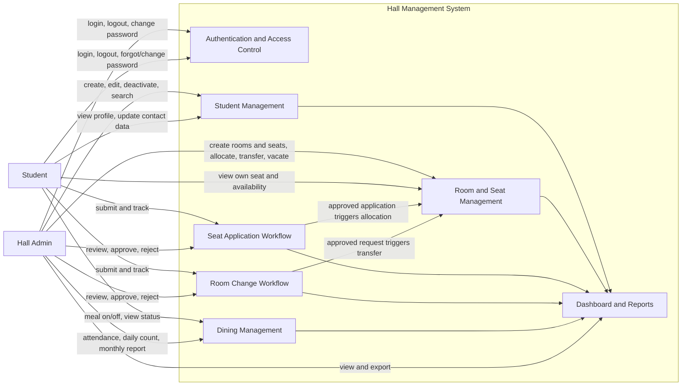

## 3. Core Workflow Diagram

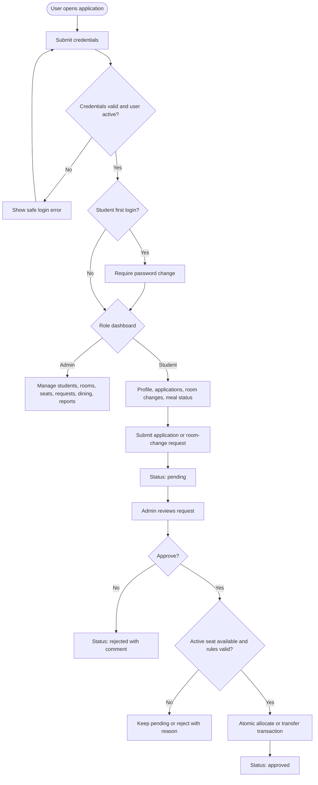

## 4. Authorization Matrix

| Capability | Admin | Student |
|---|---:|---:|
| Create student account | Yes | No |
| View all students | Yes | No |
| View own profile | Yes | Yes |
| Update student administrative fields | Yes | No |
| Update student contact information | Yes | No |
| Create/edit/deactivate rooms and seats | Yes | No |
| Allocate/transfer/vacate seat | Yes | No |
| View available seats | Yes | Yes |
| Submit seat application | No | Yes |
| Approve/reject seat application | Yes | No |
| Submit room change request | No | Yes |
| Approve/reject room change request | Yes | No |
| Change own meal status | No | Yes |
| Record dining attendance | Yes | No |
| View operational reports | Yes | No |

All permissions must be enforced server-side with middleware, policies, or gates. UI visibility alone is not authorization.

## 5. Target Schema Diagram

SQLite is the local database. Use Laravel migrations, foreign keys, indexes, and application transactions. IDs may remain Laravel integer IDs unless the user explicitly requests UUID migration.

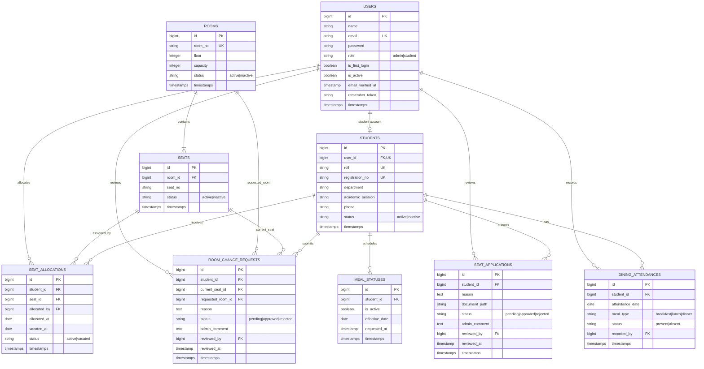

## 6. Schema Constraints

Required database or transaction-level protections:

- `users.email`, `students.roll`, `students.registration_no`, and `rooms.room_no` are unique.
- `students.user_id` is unique, enforcing one student profile per student user.
- Composite unique index on `seats(room_id, seat_no)`.
- Composite unique index on `dining_attendances(student_id, attendance_date, meal_type)`.
- A room cannot have more active seats than its capacity.
- Only one active allocation may exist per student.
- Only one active allocation may exist per seat.
- Request approval and allocation/transfer happen in one database transaction.
- A room-change request stores the current seat at submission time for auditability.
- Historical allocations, requests, meal changes, and attendance records are retained.

SQLite cannot express every conditional uniqueness rule consistently across environments. Enforce active-allocation uniqueness with transactions, locked/rechecked records where supported, and focused tests.

## 7. Laravel Module Shape

Use this shape as modules become necessary; do not create empty files early.

```text
app/
  Actions/                 Complex transactional use cases
  Enums/                   Role and workflow statuses
  Http/Controllers/
    Admin/
    Student/
  Http/Requests/           Form Request validation
  Models/                  Eloquent models and relationships
  Policies/                Ownership and role authorization
resources/views/
  layouts/
  admin/
  student/
database/
  migrations/
  factories/
  seeders/
tests/
  Feature/
  Unit/
```

## 8. Development Dependency Diagram

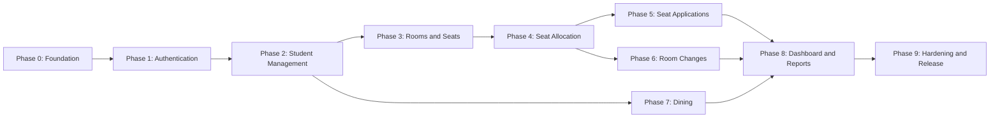

## 9. Detailed Development Path

### Phase 0: Foundation

Deliver:

- Confirm environment and SQLite migrations run.
- Replace starter welcome page with shared authenticated layout skeleton.
- Add enums/constants strategy, test helpers, and admin development seeder.
- Define route groups and authorization approach.

Exit gate:

- `composer run test` and `npm run build` pass.
- Admin seed account can be created without committing credentials.

### Phase 1: Authentication And Access Control

Deliver:

- Admin and student login/logout.
- Role and active-state middleware.
- Forgot/change password.
- Forced first-login password change.
- Block public registration.

Exit gate:

- Inactive users cannot log in.
- Students cannot access admin routes.
- First-login students cannot bypass password change.

**Implemented (2026-07-05):** `users.is_first_login`, `users.is_active`, student change-password routes, `EnsureStudentPasswordChanged` and `EnsureUserIsActive` middleware, login redirect for first-login students, and inactive-account login blocking.

### Phase 2: Student Management

Deliver:

- Admin creates, lists, searches, edits, and deactivates students.
- Creation atomically creates `users` and `students`.
- Default password equals roll number and is hashed.
- Student views profile and updates allowed contact fields.

Exit gate:

- Duplicate roll/email/registration number rejected.
- Students cannot view or edit another student's profile.


### Phase 3: Room And Seat Management

Deliver:

- Admin room CRUD and activation state.
- Admin creates/manages seats within capacity.
- Room list/details show capacity, occupied, and available counts.
- Students can view available seats.

Exit gate:

- Room capacity cannot be less than existing active seats.
- Inactive rooms/seats cannot receive allocations.

### Phase 4: Seat Allocation

Deliver:

- Admin allocates, transfers, and vacates seats.
- Allocation history remains available.
- All allocation changes use transactions.

Exit gate:

- Concurrent or repeated actions cannot double-allocate student or seat.
- Occupancy and availability remain correct after allocate/transfer/vacate.

### Phase 5: Online Seat Applications

Deliver:

- Student submits one valid pending application and tracks status.
- Admin lists, reviews, comments, approves, or rejects.
- Approval optionally allocates a selected available seat atomically.

Exit gate:

- Student cannot submit when already allocated unless business rule permits it.
- Approval cannot overbook a room or seat.

### Phase 6: Room Change Requests

Deliver:

- Allocated student submits and tracks room-change request.
- Admin approves/rejects with comment.
- Approval transfers seat atomically.

Exit gate:

- Only allocated students can request a change.
- Failed transfer leaves original allocation unchanged.

### Phase 7: Dining Management

Deliver:

- Student schedules meal on/off changes.
- Enforce configurable cutoff and next-day effective date.
- Admin records attendance and views daily/monthly summaries.

Exit gate:

- Duplicate attendance records are prevented.
- Daily count uses effective meal status for selected date.

### Phase 8: Dashboard And Reports

Deliver:

- Admin dashboard metrics: students, rooms, occupied/available seats, pending requests, today's meals.
- Student, occupancy, application, room-change, and dining reports.
- Export only after on-screen report filters and authorization work.

Exit gate:

- Metrics match database state and avoid N+1 queries.
- Students cannot access operational reports.

### Phase 9: Hardening And Release

Deliver:

- Full authorization audit.
- Validation and error-state audit.
- Accessibility and responsive UI review.
- Seed/demo data, deployment notes, backups, and restore procedure.
- Full automated test and production build.

Exit gate:

- `composer run test`, `vendor\bin\pint --test`, and `npm run build` pass.
- No secrets, debug output, or default credentials are committed.

## 10. Per-Story Implementation Path

For every story, work in this order:

1. Write acceptance criteria and identify role/ownership rules.
2. Add or update migration constraints.
3. Add model relationships, casts, and enums.
4. Add policy/gate and Form Request validation.
5. Add transactional action/service when business state changes.
6. Add thin controller and routes.
7. Add Blade/Tailwind UI with success/error/empty states.
8. Add feature tests and focused unit tests.
9. Run relevant test, full tests when practical, Pint, and frontend build.
10. Update this blueprint when schema, rules, or development path changes.

## 11. Application Architecture Diagram

Every feature should follow this request path. Keep business decisions out of Blade views and keep controllers thin.

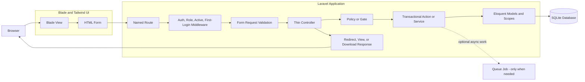

## 12. Module Dependency Diagram

Dependencies flow downward. Avoid circular dependencies between modules.

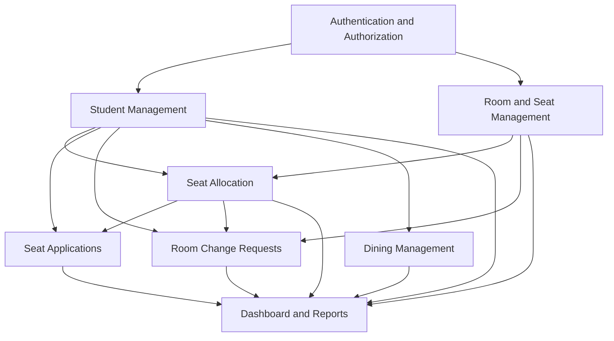

Rules:

- Reports read module data but do not own operational business rules.
- Seat applications and room changes must call the same allocation actions used by direct admin allocation.
- Authentication owns identity and access; student profile owns hall-specific student information.
- Dining must not depend on allocation unless a future explicit rule requires residents to have seats.

## 13. Route And Request Lifecycle Diagram

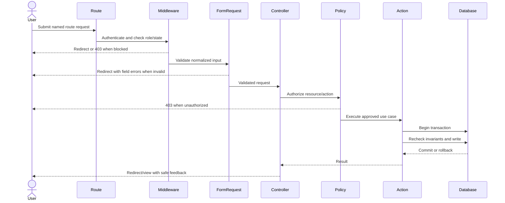

## 14. Workflow State Diagrams

### User Account State

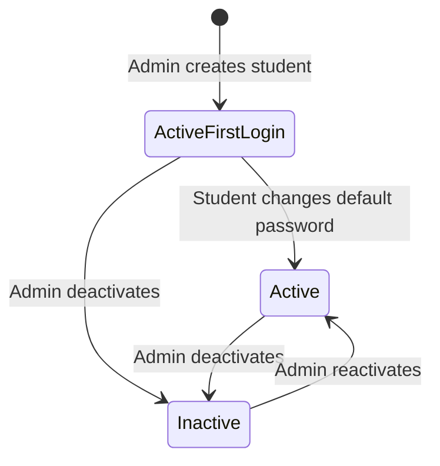

### Seat Allocation State

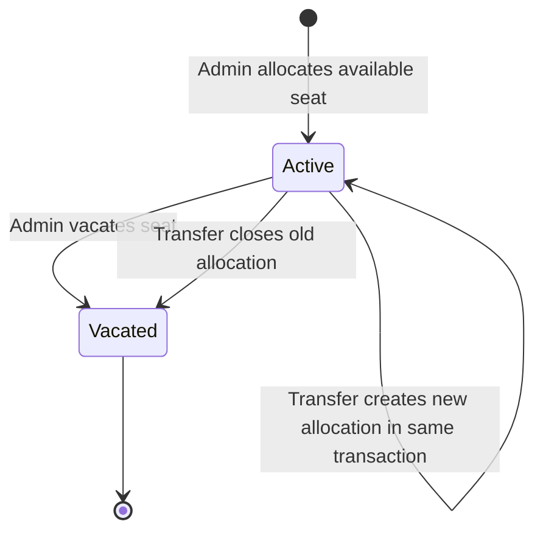

### Application And Request State

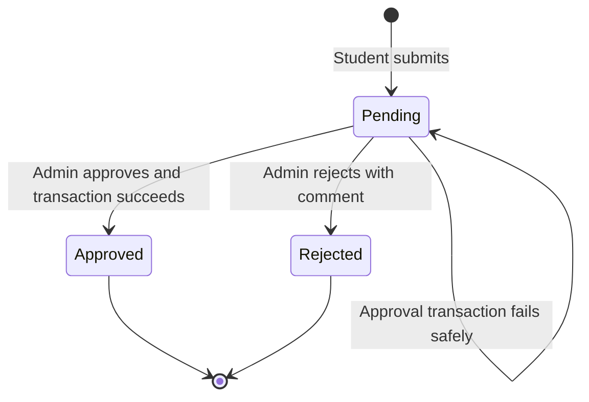

### Meal Status State

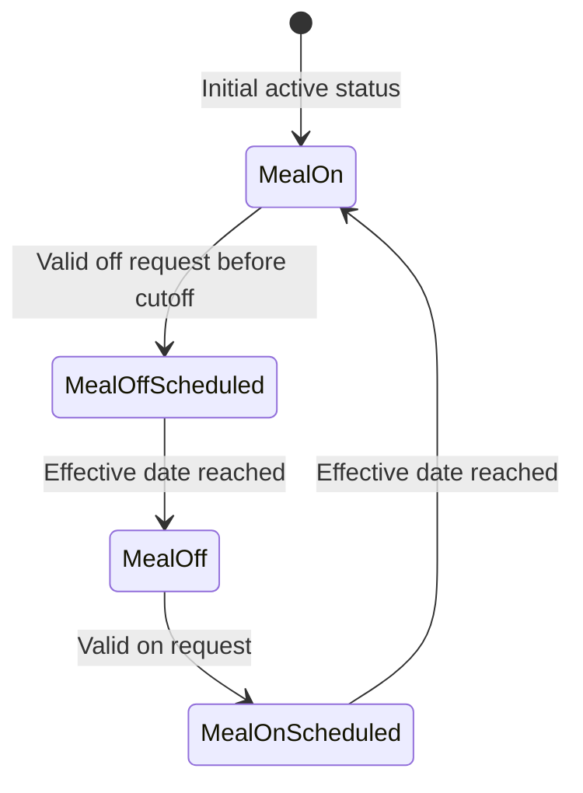

## 15. Atomic Seat Operation Diagram

All direct allocations, approved applications, and approved room changes must use one shared transaction path.

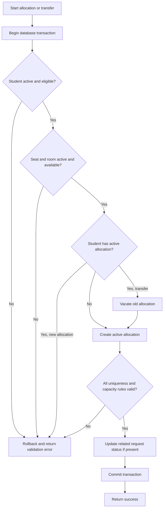

## 16. Security Boundary Diagram

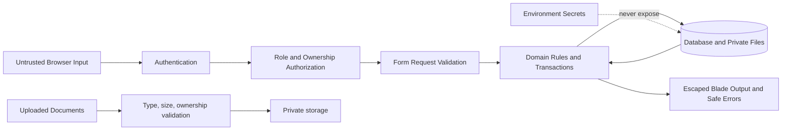

Mandatory security rules:

- Never trust IDs, roles, statuses, occupancy, reviewer identity, or ownership from forms.
- Use CSRF protection on state-changing web requests.
- Escape output by default; do not use raw Blade output for user content.
- Store uploaded documents privately and authorize every download.
- Show generic login/reset errors that do not reveal account existence.
- Log important admin actions without logging passwords or sensitive document contents.

## 17. Test Coverage Diagram

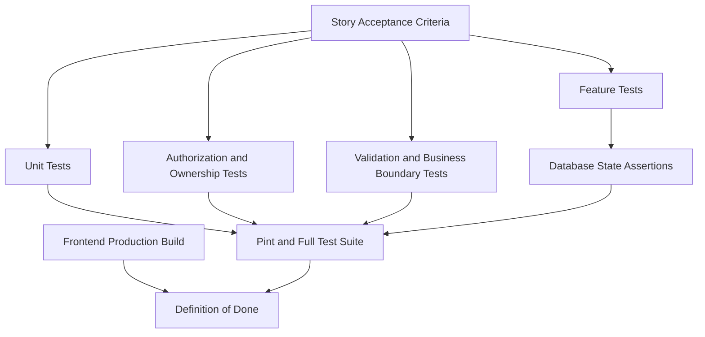

Each workflow-changing story requires at least:

- happy-path feature test
- unauthorized-role or wrong-owner test
- invalid-input test
- critical business-rule boundary test
- database state assertion after success and failure

## 18. Team Git And Jira Development Flow

All teammates should follow this same flow. A story has one primary assignee; teammates may own separate subtasks.

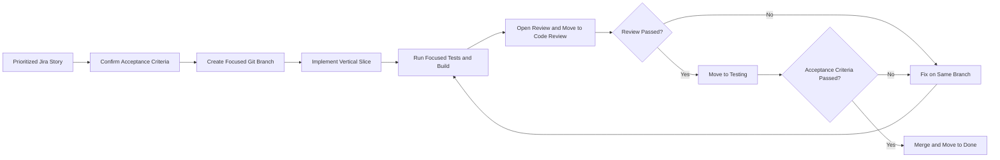

Team rules:

- One branch and pull request per focused story or bug.
- Never mix unrelated refactors into feature work.
- Never rewrite or remove another teammate's uncommitted work.
- Database changes use new migrations; do not edit already-shared migrations.
- Pull requests state acceptance criteria, schema impact, screenshots for UI work, and checks run.
- Merge only after review, tests, and acceptance criteria pass.

## 19. Blueprint Change Control

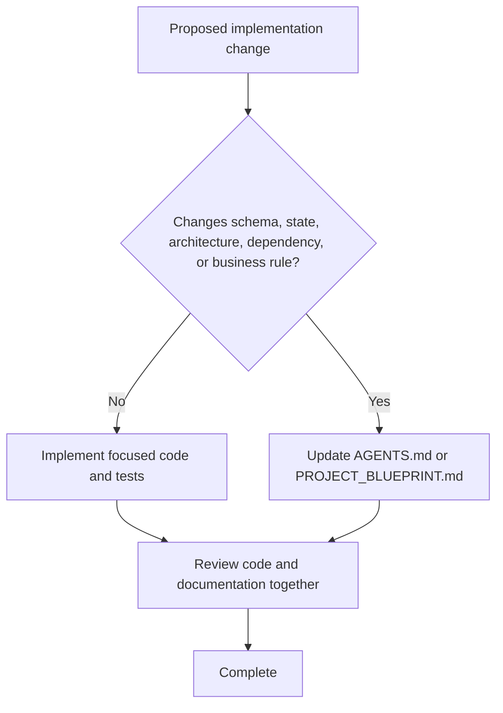

`AGENTS.md` and this blueprint are version-controlled project artifacts. Every teammate and AI agent must keep them synchronized with implementation.
